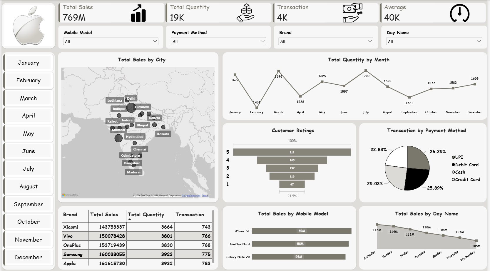

# 📱 Mobile Sales Analysis Dashboard | Power BI

## 📊 Project Overview

This project presents an interactive Mobile Sales Analysis Dashboard developed using Microsoft Power BI.

The dashboard analyzes mobile sales performance across different brands, mobile models, cities, months, payment methods, customer ratings, and days of the week.

The objective is to transform raw sales data into meaningful business insights that can support data-driven decision-making.

---

## Transformation

Days, months given in separate columns were made into one date column using custom column.

---

## 🛠️ Tools & Technologies

- Microsoft Power BI
- Power Query
- DAX
- Microsoft Excel
- Data Visualization
- Business Intelligence

---

## 📌 Dashboard KPIs & DAX

- Total Sales: 769M (DAX used: Total Sales = SUMX(MobileSalesData,MobileSalesData[Units Sold]*MobileSalesData[Price Per Unit]))
- Total Quantity: 19K (DAX used: Total Quantity = SUM(MobileSalesData[Units Sold]))
- Total Transactions: 4K (DAX used: Transaction = COUNTROWS(MobileSalesData))
- Average Sales: 40K (DAX used: Average = AVERAGE(MobileSalesData[Price Per Unit])

---

## 📈 Dashboard Features

### Sales Analysis
- Total Sales by City
- Total Sales by Mobile Model
- Total Sales by Day Name

### Product Analysis
- Brand-wise Sales
- Brand-wise Quantity
- Brand-wise Transactions
- Mobile Model Performance

### Customer Analysis
- Customer Ratings
- Payment Method Analysis

### Time Analysis
- Monthly Quantity Trends
- Daily Sales Trends

### Interactive Filters
- Mobile Model
- Payment Method
- Brand
- Day Name
- Month

---

## 🔍 Key Insights

- Apple recorded the highest total sales among the brands shown.
- July recorded the highest monthly quantity at approximately 1,700 units.
- Saturday recorded the highest sales among the days shown.
- UPI accounted for the largest share of transactions among the payment methods.

---

## 📷 Dashboard Preview



---

## 📂 Repository Structure

```text
Mobile-Sales-PowerBI-Dashboard/
│
├── README.md
│
├── Mobile_Sales_Dashboard.pbix
│   
├── Day - 30 - Mobile Sales Data.xlsx
│   
└── Mobile_Sales_Dashboard.png
